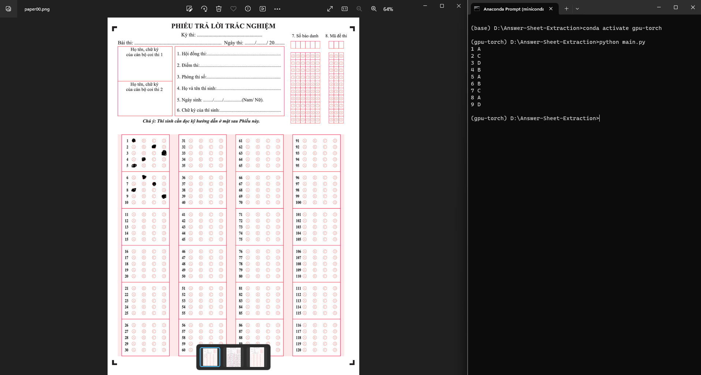
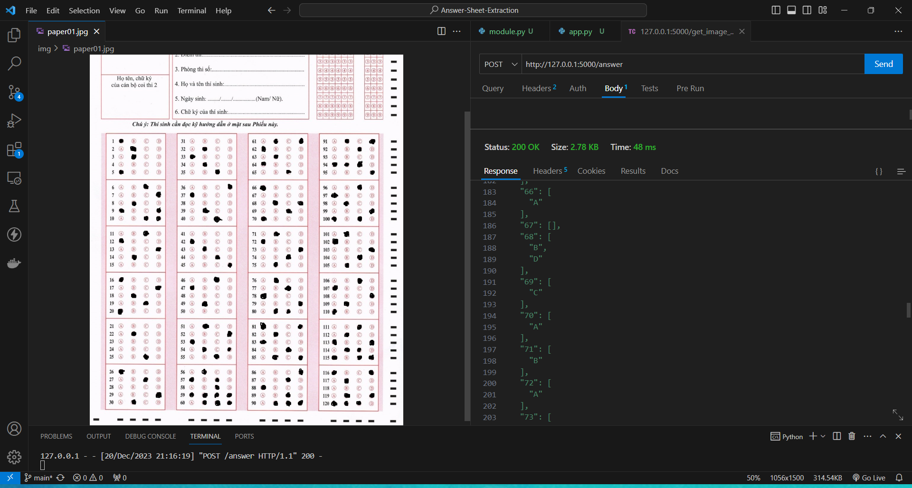

# Answer-Sheet-Extraction
Vietnamese High School Graduation Examination Answer Extraction using openCV-python

# Installation & Run
1. Clone repository
2. Run ```pip install -r requirements.txt```
3. Change the image path in ```config.yml```
4. Run ```python module.py```

# Run with Flask API
1. Clone repository
2. Run ```pip install -r requirements.txt```
3. Run ```python app.py```
4. Use Postman, Thunder Client, or ```curl -X POST -F "image=@path/to/your/image.jpg" http://127.0.0.1:5000/get_image_size```

# Screenshot
1. Run ```python module.py```

2. Run ```python app.py```


# Notes
Highly recommend using conda/miniconda for avoiding evironments conflicts.